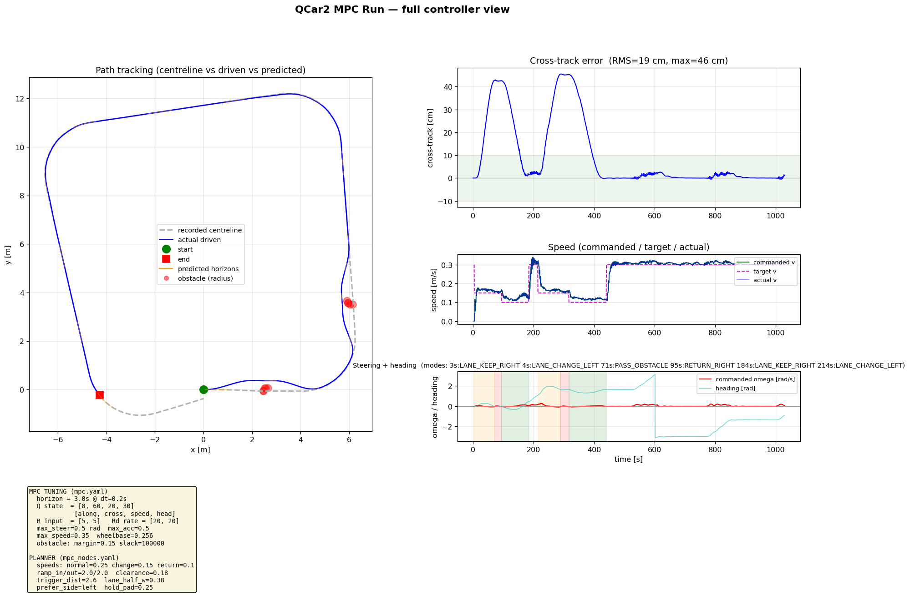

# QCar2 MPC-Controlled Autonomous Driving

ROS 2 Jazzy + Gazebo Harmonic workspace for a Quanser QCar2 lane-following and
obstacle-overtaking stack driven by **Model Predictive Control (MPC)**.

The current milestone runs a single QCar2 in the `lab_track` Gazebo world. It
follows a recorded lane centreline with an MPC tracker, uses LiDAR to detect
obstacles ahead, plans a smooth S-curve overtake around them, and returns to the
lane — all as trajectory optimization, not a reactive state machine. This stack
is being prepared for the real Quanser QCar2 after simulation validation.



*Full controller view: recorded centreline vs driven path + predicted horizons
(left), cross-track error, commanded/target/actual speed, steering + mode
timeline (right), and the live tuning values (bottom-left).*

## Architecture

Clean **perception → planner → controller** split:

```
/qcar2/lidar/scan ─► mpc_lidar_obstacle_node ─► /mpc/obstacle
/model/qcar2/odometry ─┐                              │
track_waypoints.npy ─► mpc_reference_planner_node ◄───┘
                          │ builds shifted S-curve reference + speed
                          ▼
                   /mpc/reference_path, /mpc/target_speed, /mpc/mode
                          │
/model/qcar2/odometry ─► mpc_drive_node (MPC) ─► /model/qcar2/cmd_vel
```

- `qcar2_description`: QCar2 URDF, meshes, sensors, Ackermann model.
- `qcar2_worlds`: Gazebo `lab_track` world and map assets.
- `qcar2_bringup`: simulation bringup and ROS/Gazebo bridge.
- `qcar2_autonomy`: the MPC stack (perception, reference planner, MPC tracker)
  plus the RF-DETR ONNX lane node (used as a debug overlay / path-recording aid).
- `qcar2_msgs`: shared custom ROS messages.

See [MPC_GUIDE.md](MPC_GUIDE.md) for the full math (bicycle model, cost function,
S-curve geometry) and the story of every problem we solved.

## Build

```bash
cd ~/rosbot_ws
source /opt/ros/jazzy/setup.bash
colcon build --symlink-install --packages-up-to qcar2_autonomy qcar2_bringup
source install/setup.bash
```

MPC dependencies (one-time):

```bash
python3 -m pip install --user --break-system-packages cvxpy clarabel
```

## Run The MPC Obstacle-Overtaking Demo

A recorded path (`track_waypoints.npy`) is included, so you can run directly.

### Terminal 1 — Gazebo (headless)

```bash
cd ~/rosbot_ws
source /opt/ros/jazzy/setup.bash
source install/setup.bash
ros2 launch qcar2_bringup sim_bringup.launch.py headless:=true
```

Wait for:

```text
Camera images for [qcar2::base_link::front_camera] advertised on [/qcar2/front_camera/image]
```

### Terminal 2 — Spawn obstacle(s)

```bash
cd ~/rosbot_ws
source /opt/ros/jazzy/setup.bash
source install/setup.bash
./scripts/spawn_box.sh 2.0 -6.20
```

### Terminal 3 — MPC stack

```bash
cd ~/rosbot_ws
./scripts/run_mpc.sh
# RECORD=1 ./scripts/run_mpc.sh   # also logs the run for plotting
```

### Terminal 4 — Viewer (optional)

```bash
cd ~/rosbot_ws
source /opt/ros/jazzy/setup.bash
source install/setup.bash
python3 scripts/view_overlay.py
```

### Plot a recorded run

```bash
python3 scripts/plot_mpc_run.py    # -> mpc_run_plot.png
```

## What The Demo Does

1. Gazebo runs the QCar2 and publishes camera/LiDAR/odometry topics.
2. A box is spawned ahead in the lane.
3. `run_mpc.sh` starts the three MPC nodes (perception, reference planner, tracker).
4. The LiDAR node detects the obstacle and estimates its position + size.
5. The reference planner bends the lane centreline into a smooth S-curve around
   it (Frenet lateral-offset) and slows the target speed.
6. The MPC tracker follows that reference, producing steering + speed.
7. After passing, the reference returns to the centreline and normal speed
   resumes. Multiple spaced obstacles are handled one after another.

## Key Topics

| Topic | Purpose |
|---|---|
| `/qcar2/front_camera/image` | Front camera stream from Gazebo. |
| `/qcar2/lidar/scan` | 2D LiDAR scan. |
| `/model/qcar2/odometry` | Vehicle pose + speed (MPC state). |
| `/mpc/obstacle` | LiDAR obstacle: `[x, y, radius, front_dist, left_clear, right_clear]`. |
| `/mpc/reference_path` | World-frame reference path the MPC tracks. |
| `/mpc/target_speed` | Speed setpoint (lower during overtake). |
| `/mpc/mode` | Behaviour state: `LANE_KEEP_RIGHT`, `LANE_CHANGE_LEFT/RIGHT`, `PASS_OBSTACLE`, `RETURN_RIGHT`. |
| `/model/qcar2/cmd_vel` | Final Gazebo drive command. |

## Useful Scripts

| Script | Purpose |
|---|---|
| `scripts/run_mpc.sh` | Starts the LiDAR / reference-planner / MPC tracker stack. |
| `scripts/record_path.sh` | Records `track_waypoints.npy` for the MPC reference. |
| `scripts/spawn_box.sh` | Spawns a tall LiDAR-visible test obstacle. |
| `scripts/plot_mpc_run.py` | Plots a recorded run (path, error, speed, steering, params). |
| `scripts/view_overlay.py` | Live RF-DETR/debug overlay window. |
| `scripts/stop_lane_keeping.sh` | Stops the running sim/autonomy processes. |

## Tuning

All controller values live in two files (and are printed on the run plot):

- `config/mpc.yaml` — MPC cost weights, horizon, vehicle limits.
- `config/mpc_nodes.yaml` — planner speeds, overtake ramp lengths, trigger
  distance, side selection, LiDAR detection.

## Notes

- Headless Gazebo is required — the GUI plus GPU inference overloads a single
  laptop GPU and freezes the sim.
- The MPC tracks the recorded centreline using odometry (accurate in sim). On the
  real car this would be paired with vision/localization.
- The RF-DETR ML model is a debug overlay in this stack, not the controller; it
  was used to record the lane path. See [MPC_GUIDE.md](MPC_GUIDE.md).
- Large weights, caches, videos, and run artifacts are excluded from Git.

## Repositories

Code:

```text
https://github.com/6hammad9/qcar2-lane-keeping
```

Weights:

```text
https://huggingface.co/HammadNaseer/qcar2-ml-steering-weights
```
